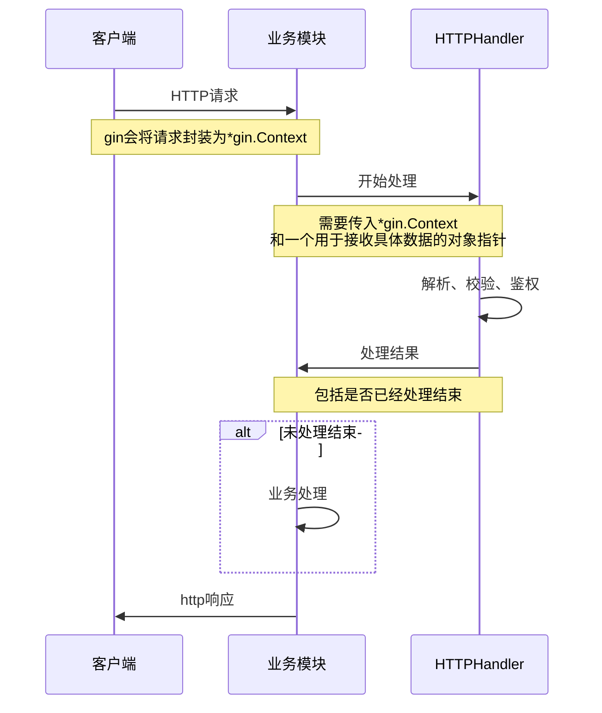
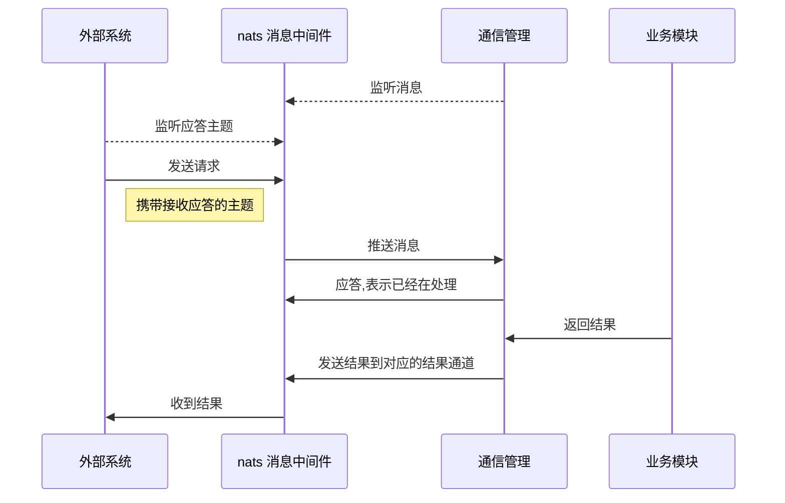
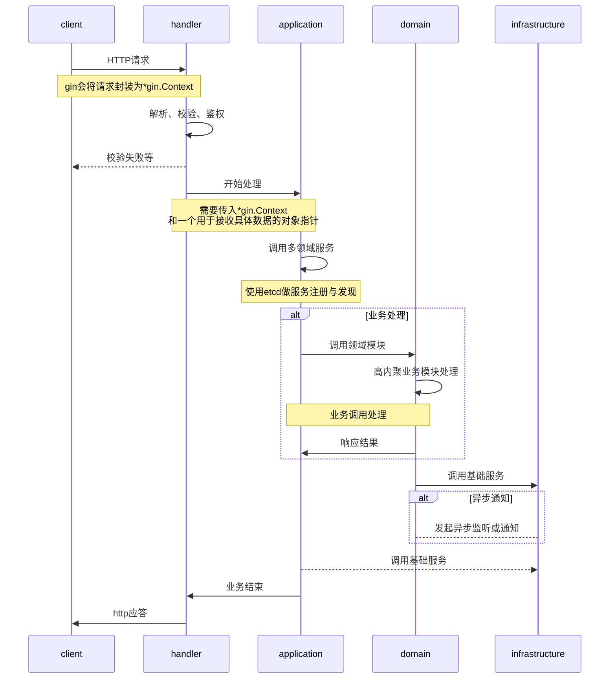

[TOC]

# 概述

由于以前的不完善需求.导致项目分割严重.不利于以后的项目发展.由此进行架构变动.

# 版本

|   版本     |   修改人  |   修改时间             |   修改内容    |   备注    |
|   ---     |   ---    |    ---                |      ---     |   ---    |
|   v0.1    |   lx    |  2023-03-23 11:04:05  |   初步完成    |   无      |


# 详细描述

基于当前的需求.设计初步新版项目架构.引进新的组件.解决当前项目的扩展性,重复性,可演进性等.
架构变动的基本原因:
- 好的架构,可以使用最小的人力成本满足构建和维护该系统的需求.
- 便于项目的后期维护及迭代.

## 项目争论点

1. 行为大于架构
不能按预定行为工作的软件是不产生价值的,所以认为能实现软件行为是最重要的.
无需关心架构,反正坏的架构也不是实现不了行为,出了bug修复即可.

2. 都可以
一个简易的架构,在项目初期有时难以察觉,因为此时项目模块少,功能少,依赖关系显而易见,一切显得毫无恶意,甚至有点简洁美.
所以能实现功能即可.演化为都行.只满足当前需求.
当项目的增长,模块增加,对开发人员而言,项目理解成本不断增加,添加小功能都要先理清好几个模块的调用关系,难以测试导致上线后 bug 防不胜防,组件无法复用等.

3. 架构的成本
架构设计是为了让未来的修改更加容易,吸取开发过程中的经验以及业务特点.推出能在未来降低修改某种行为的人力成本,或者降低某种行为修改成本.
架构设计之初会增加一定的系统理解成本,但是一个好的架构理解成本一定不会很高.本质上是降低了项目发展过程中整体理解成本.

4. 项目其它因素
因为架构投资的是未来,但大部分人只着眼于当下.所以会和他人产生观点冲突.

## 重构计划

### 方式及难点

1. 无法单独计划时间作为整体重构.
    - 项目时间不允许
    - 人力成本不允许
    - 新需求迭代不允许

2. 计划碎片化时间重构部分功能与其余部分隔离,以新的架构进行单独改造
    - 需求一直迭代.
    - 进程需要长时间.
    - 影响范围可能有多次变动.

3. 将新需求使用新架构.
    - 会存在多服务共存问题.
    - 重构颗粒度较大.
    - 针对原有项目具有入侵性.

### 方式筛选

- 筛选可行性:
    - 方式1:直接放弃.成本过高.

    - 方式2与方式3:结合使用.

- 实施计划
    - 需求为新功能时.使用方式3.节约使用方式2的成本.
    - 当需求为变动是修改时.使用方式2.缓慢推进.
    - 最终完成重构.

## 当前项目设计

1. 项目核心功能分为三大块
    - 作为Web API Server
    - 接收HTTP请求
    - 异步定时任务

2. 每一层基本都是单一一个包,包内代码质量不高,重复代码较多

3. 当前项目的问题
    - 多次方向变动导致.依赖关系混乱.
    - 每层内部没有设计.随意暴露公共函数.各层之间也是直接进行函数调用.
    - 无法单测服务.需使用api接口请求.
    - 模块划分不清.想复用模块功能但是不知道对应的函数是哪个.


##### 业务流程




## 新架构设计

1. 外部依赖接口化

对外部服务的调用 service 都用 Interface 进行抽象.
任何模块都不直接使用 service 的具体实现，这解耦了业务逻辑和外部服务

2. 模块单一化
service 模块都应该只对一类行为者负责.

3. 依赖反转
当前项目很多是在具体实现类上创建衍生类.不符合go的风格.
高层模块不应该依赖低层模块,二者都应该依赖其抽象.
抽象不应该依赖细节,细节应该依赖抽象.
- 结构体不应依赖于另一个结构体,这会导致紧密耦合.
```go
type User struct {
    Name string
    Age  int
}

type UserNickname struct {
    Nickname map[string]string
}

// 依赖具体的结构体
func (u *User) GetNickname(n *UserNickname) string {
    nickname := ""
    if _,ok := n.Nickname[u.Name];ok {
        return n.Nickname[u.Name]
    }

    return nickname
}

// 处理
type Nickname interface {
    Nickname(name string) string
}

// 仅需要实现了Nickname接口.即可获取到nickname.不限定具体的结构体
func (u *User) GetNickname(n Nickname) string {
    return n.Nickname(u.Name)
}
```

4. 稳定抽象
依赖关系必须要指向更稳定的方向.
如果稳定组件还是需要依赖不稳定组件,那么我们需要在他们中间加入一层稳定的抽象层.
接口不应为写接口而提供接口.

```go
// 此接口依赖提供name的结构体.设定name来源于结构体中.
type Nickname interface {
    Nickname(name string) string
}

// 变更user结构体为接口
type User interface {
    Name() string
    Age()  int
}

type Nickname interface {
    Nickname(u User) string
}
// 那么nickname接口的使用.将不在局限于特定结构体了.只需要实现user接口的都可使用.增加了可重用性.
```

### 结构设计

1. 垂直划分
借鉴领域驱动适合于我们项目的行垂直切片思想
那么应用在我们项目.可以将模块划分成了不同领域（Domain）,每个领域责任明确且高度内聚.
不同模块之间需要制定严格的边界, 模块暴露的接口,事件,模块之间的依赖关系都该被严格把控.

2. 水平分层
跨多模块的业务逻辑上拉至 Domain 的上级 Application 层中，让各自的模块逻辑包含明显的业务边界.
这可用于处理依赖多个组件的业务逻辑,各层之间依赖于接口而非实现,且下层不能依赖上层.

合理且优秀的示例:
```go
package post

// 接口对外导出,解耦. 且应是高度抽象.避免不要写类型来满足接口,而应该写接口来满足使用要求.
// 且应该是依赖接口,不要依赖实现
type Service interface {
    ListPosts() ([]*Post, error)
}

// 服务对内实现.非导出.避免struct内部变量被污染,返回接口,隐藏内部的实现结构体
type service struct {
    conn *grpc.ClientConn
    id  int64
}

func NewService(conn *grpc.ClientConn) Service {
    return &service{
        conn: conn,
    }
}

func (s *service) ListPosts() ([]*Post, error) {
    posts, err := s.conn.ListPosts(...)
    if err != nil {
        return []*Post{}, err
    }
    
    return posts, nil
}
```


3. 针对需要关注其它模块
模块之间可以定义事件并发布到事件总线,如果对有某个模块事件感兴趣，就可以订阅事件.

见如下通讯协议设计:

#### 通信协议

通过**nats消息中间件**进行通信


###### 交互方式

采用异步的通信模式



###### 数据格式

**请求**
所有请求统一采用json格式，定义如下

```json
{
    "reqID":0,
    "data":{},
    "code":0,
    "key":"xxxx",
    "reply":"xxxx"
}
```
*   reqID   请求，不同请求必须不同
*   data    表示具体API的参数定义，各不相同
*   code    表示请求类型
*   key     每个外部应用一个独一无二的id,识别外部应用
*   reply   接收返回值的主题

**应答**

```json
{
    "reqID":0,
    "key":"xxx",
    "code":0,
    "data":{},
    "errorCode":0,
    "errMsg":"错误信息"
}
```
*   reqID/key/code   都是传入的参数

*   errCode 表示错误代码
    *   0   正确
    *   1   json数据错误
    *   2   code 错误
    *   3   key不存在
    *   4   参数业务校验错误
    *   5   重复请求
    *   6   没有repl字段
    *   7   其他错误

*   errMsg 表示具体的错误信息
*   data    表示具体的返回值


#### 重构项目设计示意图





### 后期维护

1. 随着业务的发展,会有越来越多的模块加入.
根据前面的架构,我们只需要借鉴其他模块的设计,新建一个模块,并在让模块负责人在此模块中迭代需求即可.

2. 独立化为基础设施
模块内业务逻辑越来越复杂,或者因为业务调整,需要独立出项目.
因为模块进行了垂直划分.明确且高度内聚.难度不大.

3. 微服务化
以后可能随着模块不断剥离,项目的模块不断的成为独立的服务.
当服务增多时,就需要引入更加统一有效的运维、监控、部署方案.
我们相信这才是项目微服务化最自然的方式,我们倾向于项目尽量是单体应用.

